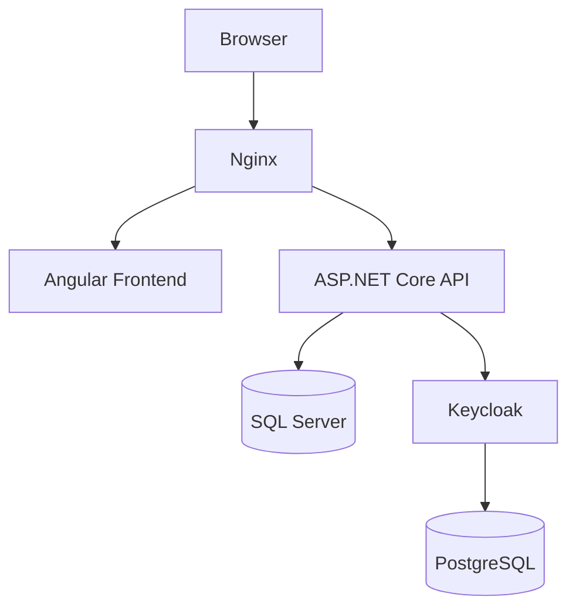
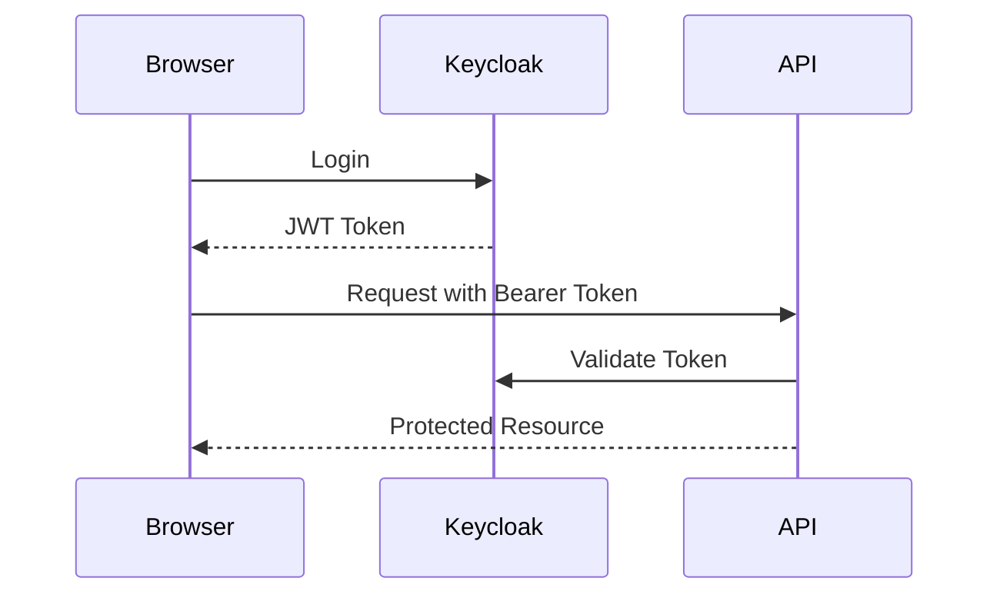

# EmployeeHub

A modern employee management application built with **ASP.NET Core 10**, **Angular 20**, **Keycloak** and **Docker**.

EmployeeHub demonstrates a clean, maintainable approach for building a full-stack business application with secure authentication, containerized deployment and automated CI/CD workflows.

---

## ✨ Features

### Employee Management

* Create, read, update and delete employees
* Employee details and department assignment
* REST API based backend architecture

### Department Management

* Create and manage departments
* Assign employees to departments
* Department-based organization

### Authentication & Authorization

* OpenID Connect authentication with Keycloak
* JWT-based API security
* Role-based authorization

### DevOps & Deployment

* Docker-based development environment
* Docker Compose orchestration
* GitHub Actions CI pipeline
* Docker images published to GitHub Container Registry
* Deployment-ready setup for Hetzner Cloud

---

# 🏗️ Architecture

EmployeeHub follows a clean architecture approach:



## Application Flow

```text
Browser
   |
   |
   v
Angular Application
   |
   |
   v
Nginx Reverse Proxy
   |
   +----------------+
   |                |
   v                v
ASP.NET Core API   Keycloak
   |
   |
   v
SQL Server
```

---

# 🛠️ Technology Stack

## Backend

* ASP.NET Core 10
* C#
* Entity Framework Core
* SQL Server
* REST API
* xUnit

## Frontend

* Angular 20
* TypeScript
* Angular Material

## Authentication

* Keycloak 26
* OpenID Connect
* OAuth 2.0
* JWT Bearer Authentication

## Infrastructure

* Docker
* Docker Compose
* Nginx
* PostgreSQL
* GitHub Actions
* GitHub Container Registry
* Hetzner Cloud

---

# 📁 Project Structure

```
EmployeeHub
│
├── backend
│   ├── EmployeeHub.Api
│   ├── EmployeeHub.Application
│   ├── EmployeeHub.Domain
│   ├── EmployeeHub.Infrastructure
│   └── EmployeeHub.Tests
│
├── frontend
│   └── Angular application
│
├── deployment
│   ├── nginx
│   └── keycloak
│
└── .github
    └── workflows
```

---

# 🚀 Getting Started

## Prerequisites

* Docker
* Docker Compose
* Git

---

## Clone Repository

```bash
git clone https://github.com/LucMarcelLeu/EmployeeHub.git

cd EmployeeHub
```

---

## Start Application

```bash
cd deployment 
docker compose up -d
```

The following services will be started:

| Service          | Description          |
| ---------------- | -------------------- |
| Angular          | Frontend application |
| ASP.NET Core API | Backend REST API     |
| SQL Server       | Application database |
| Keycloak         | Identity provider    |
| PostgreSQL       | Keycloak database    |
| Nginx            | Reverse proxy        |

---

# 🔐 Authentication

EmployeeHub uses Keycloak as identity provider.

Authentication flow:



---

# 🔄 CI/CD Pipeline

Every push to the main branch triggers GitHub Actions:

```text
Git Push

    |
    v

GitHub Actions

    |
    +--> Build Backend
    |
    +--> Build Frontend
    |
    +--> Run Tests
    |
    +--> Build Docker Images
    |
    +--> Push Images to GHCR
```

---

# 🐳 Docker Images

The project publishes Docker images through GitHub Container Registry:

```
ghcr.io/lucmarcelleu/employeehub-api

ghcr.io/lucmarcelleu/employeehub-frontend
```

---

# 🧪 Testing

Backend tests can be executed with:

```bash
dotnet test
```

---

# 🗺️ Roadmap

Planned improvements:

* [ ] Automated database migrations
* [ ] Health checks
* [ ] Integration tests
* [ ] Audit logging
* [ ] File upload support
* [ ] Monitoring and observability
* [ ] Kubernetes deployment

---

# 📌 Motivation

EmployeeHub was created as a reference project to demonstrate modern software development practices using .NET, Angular, Docker and OpenID Connect.

The goal is to build a realistic full-stack application while focusing on clean architecture, maintainability, security and automated deployment.

---

# 📄 License

This project is licensed under the MIT License.
